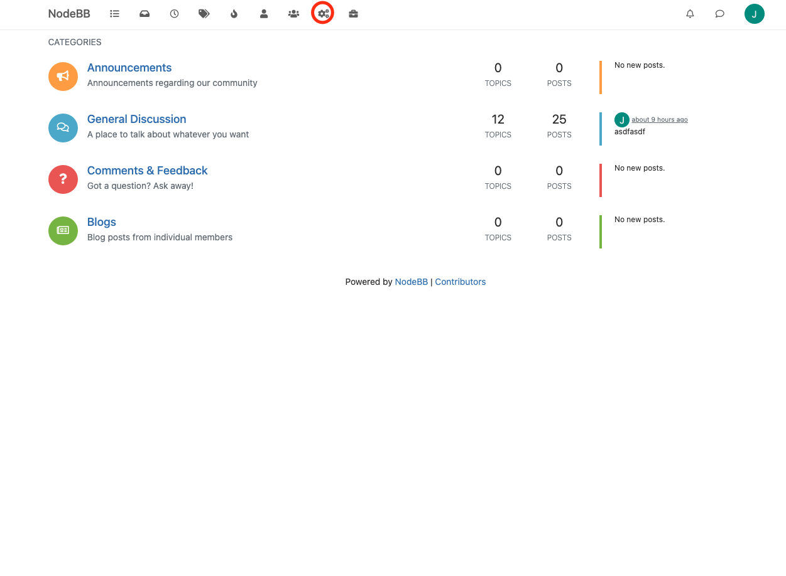
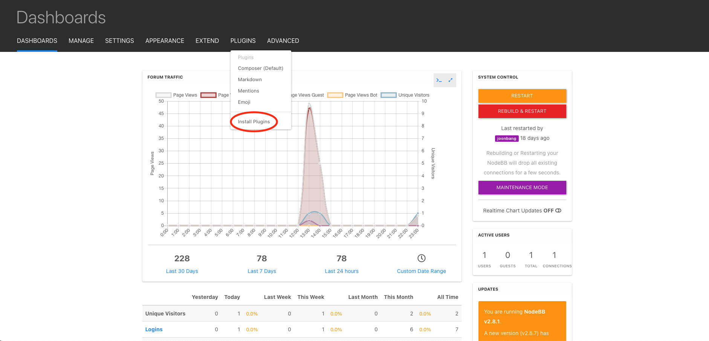
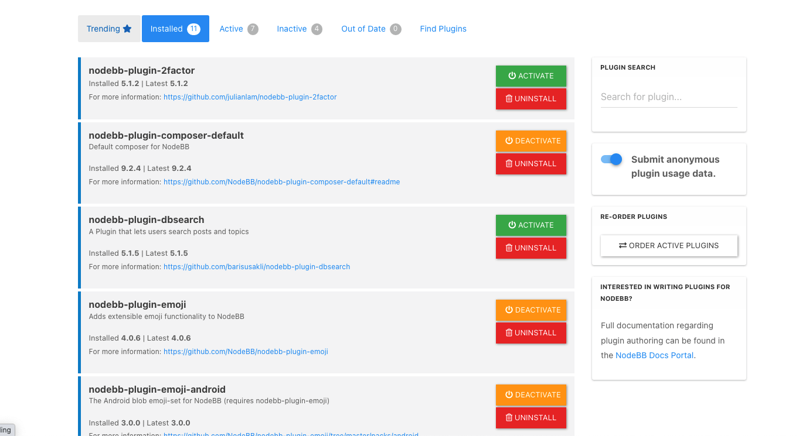

# User Guide to Anonymous Posting

 ## Setup

After building NodeBB (refer to the Getting Started guide [here](https://cmu-313.github.io/projects/P1/#repository-setup)), launch it. 

From the home page, navigate to the admin control panel, as shown below:

From here, navigate to the "Install Plugins" page. 

It should look as such:

Go to the Installed section and enable the composer-anon plugin and relaunch NodeBB. Now, anonymous posting has been enabled. 

## Usage

After setting up the plugin, when attempting to make a post, reply, or edit a post, the composer pop-up should contain a checkbox asking whether you wish to make that post anonymous. Selecting it will scrub the user image and username from that post to all viewers. 

Note that, within the internal database, the poster's information will still be stored. However, no information is visible, even through Inspect Element. 